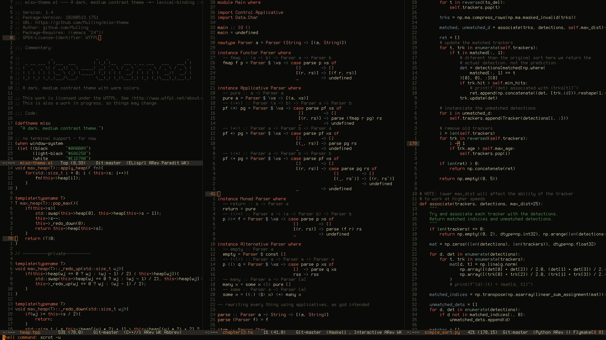

# mlso-theme

**WARNING:** THIS IS UNMAINTAINED.

A medium contrast theme for emacs.

### Screenshots

### Current supported modes:
- Company
- Dired
- Eshell
- Flycheck
- Ido
- Magit
- Markdown-mode
- Which-Key

---

This theme is mainly for my personal use and is a work in progress. If
you like it feel free to use/fork.
